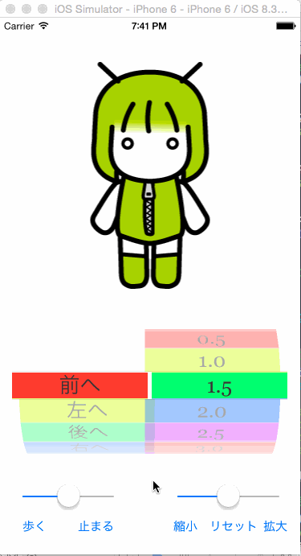

# SwinftAnime

gif annimation を Swift で表示する例です。  
  

参考資料：
- [Xcode6とSwiftで画面コンポーネントを配置して利用する](http://nanananande.helpfulness.jp/post-3403/)
- [Xcode6とSwiftでイメージやアニメーション](http://nanananande.helpfulness.jp/post-3446/)
